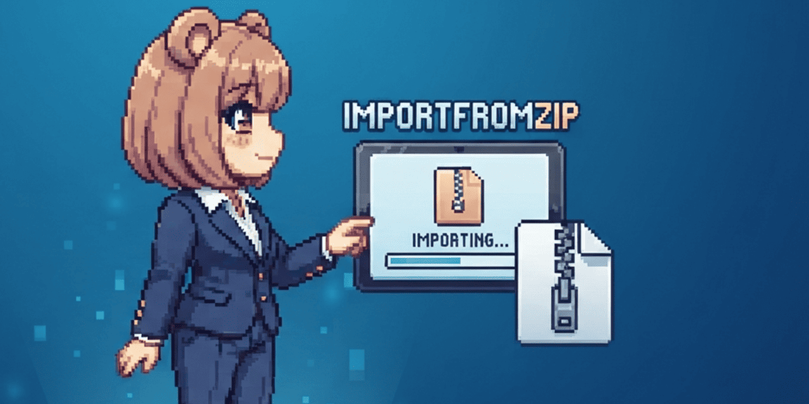

<p align="center">
  <a href="https://github.com/tsukinokun">
    
  </a>
  <a href="https://github.com/tsukinokun/ImportFromZip/blob/main/LICENSE">
    
  </a>
  
  <a href="https://qiita.com/tsukino_">
    
  </a>
</p>

<p align="center">
  
</p>

<h1 align="center">ImportFromZip</h1>


[日本語版はこちら](README.ja.md)

A simple Blender add-on that lets you import 3D files directly from a
`.zip` archive -- no need to manually extract the archive first.

## Supported formats

- FBX (`.fbx`)
- OBJ (`.obj`)
- glTF / GLB (`.gltf`, `.glb`)

More formats can be added easily -- see
[Adding support for more formats](#adding-support-for-more-formats)
below.

## Features

- Adds **File > Import > Import From Zip (.zip)**
- Extracts the selected ZIP to a temporary directory
- Recursively finds every supported file inside (including nested folders)
- Imports each one into the current scene
- Automatically cleans up the temporary directory afterwards
- Reports how many files were imported, or warns if none were found

## Requirements

- Blender **4.2** or later (uses the Extensions system)

## Installation

1. Download the latest release ZIP from the [Releases](../../releases) page
   (or clone this repo and zip the contents of the project root).
2. In Blender, go to `Edit > Preferences > Get Extensions > Install from Disk`.
3. Select the downloaded `.zip` file.
4. Make sure **Import From Zip** is enabled in the add-on list.

## Usage

1. `File > Import > Import From Zip (.zip)`
2. Select a `.zip` file that contains one or more supported files.
3. Click **Import**.

All supported files found in the archive (including in subfolders) will
be imported into the current scene. If the archive contains a mix of
formats (e.g. an FBX character plus a GLB prop), everything is imported
in one action.

## Adding support for more formats

The importer logic lives in a single `IMPORTERS` dict in `__init__.py`,
mapping a file extension to a function that imports one file of that type:

```python
def _import_fbx(filepath):
    bpy.ops.import_scene.fbx(filepath=filepath)

def _import_obj(filepath):
    bpy.ops.wm.obj_import(filepath=filepath)

def _import_glb(filepath):
    bpy.ops.import_scene.gltf(filepath=filepath)

IMPORTERS = {
    ".fbx": _import_fbx,
    ".obj": _import_obj,
    ".glb": _import_glb,
    ".gltf": _import_glb,
}
```

To add a new format, write a small `_import_xxx(filepath)` function that
calls the relevant `bpy.ops.import_scene.*` / `wm.*_import` operator,
then add it to the dict.

## Building the release ZIP yourself

The ZIP you install in Blender must contain `blender_manifest.toml` and
`__init__.py` at its **root** -- not inside a subfolder.

```bash
zip -j import_from_zip.zip __init__.py blender_manifest.toml
```

## License

[GPL-3.0-or-later](LICENSE)

## Contributing

Issues and pull requests are welcome -- especially ones adding support
for new formats. See [CONTRIBUTING.md](CONTRIBUTING.md).

## Documentation
- [explanatory article(Qiita)](https://qiita.com/tsukino_/items/b3dda3704b48267863f87)

## Author

山﨑愛/Tsukino

- [Qiita: tsukino_](https://qiita.com/tsukino_) 
- [GitHub: tsukino](https://github.com/tsukinokun)
